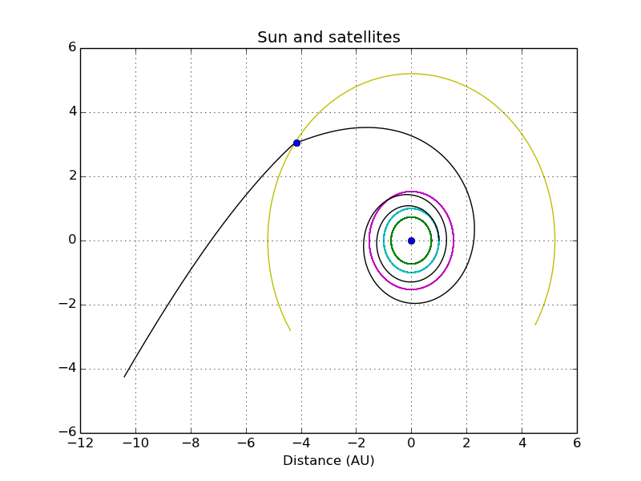
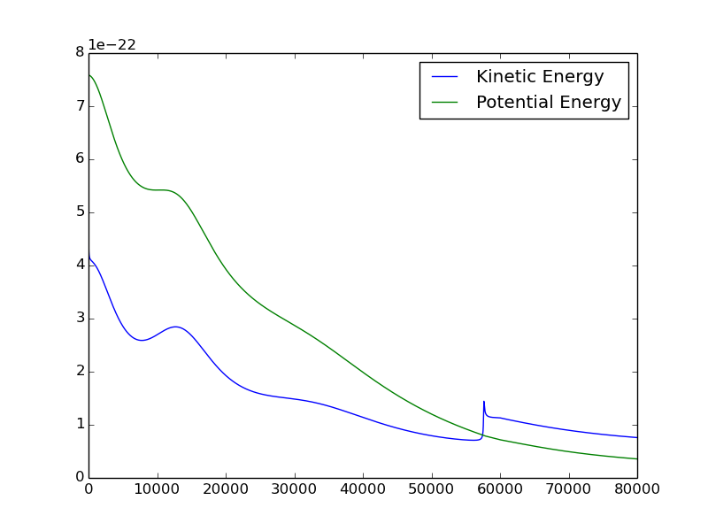

IonSim
======

Python based simulation of an ion engine accelerating through the solar system

======

The purpose of this project was to demonstrate the ability of tiny ion engines to accelerate small satellites outside the solar system within a reasonable time frame. The results can be seen most clearly seen in the following plots:

This shows the path of the satellite as it exits the solar system. In this case, 4 engines are used to accelerate a 1kg payload. The blue dot highlights a gravity assist from Jupiter.

Here you can see the kinetic and potential energies of the satellite as it accelerates. The kinetic energy surpasses the potential energy around the Jupiter fly-by which demonstrates that the satellite has reached escape velocity. 

The program works by pre-building a model of the solar system using an Euler-Cromer method, which allows for more flexibility and accuracy than a simple Kepler's laws derivation. Then the satellite is inserted into this system near geosync and acceleration begins. The entire trajectory of the satellite is calculated, saved to a data file, and then plots are produced. Data processing for the example case shown above took approximately 20 minutes on a mid-range desktop computer. 

